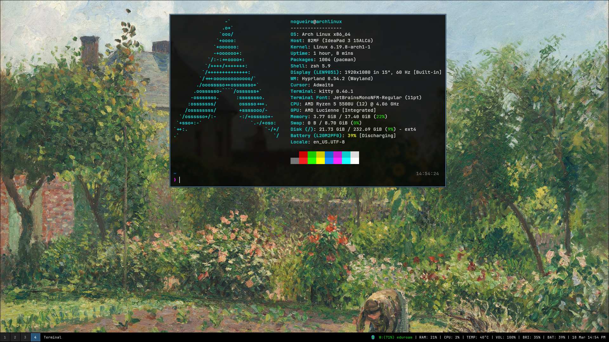
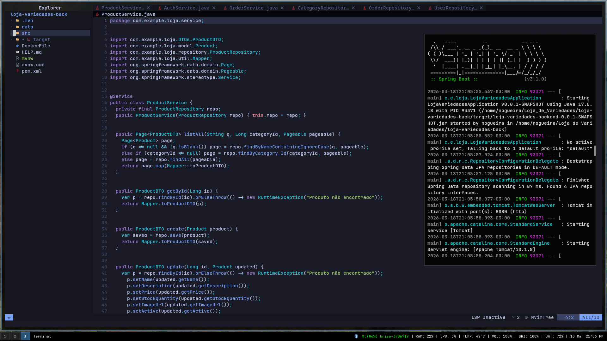
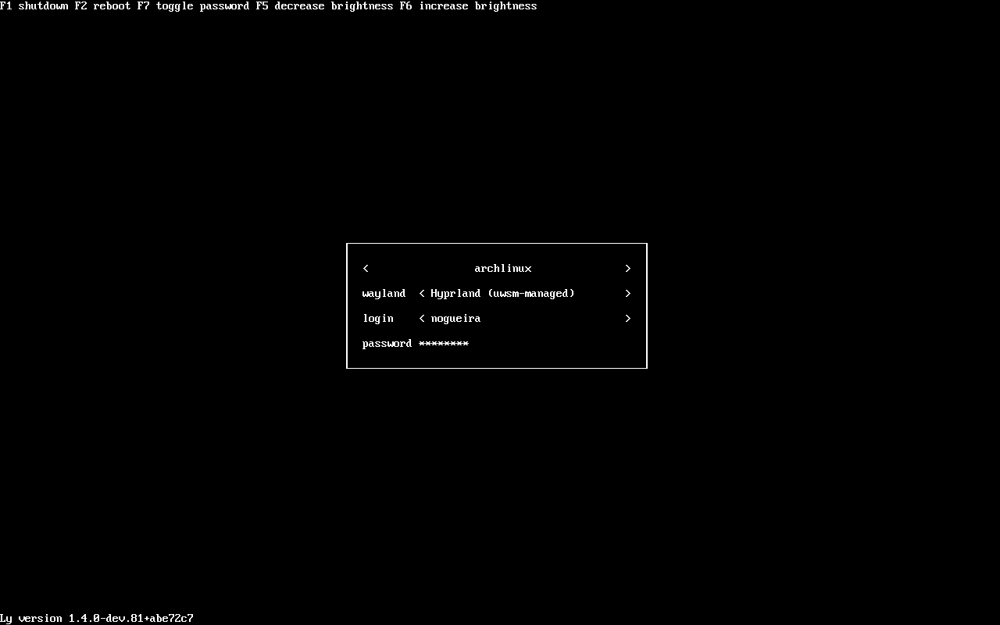

# Classic i3-Style Hyprland

Welcome to my dotfiles. This repository contains a clean, distraction-free Arch Linux configuration. The primary goal is to bring the classic, responsive feel of the i3 window manager into the modern Wayland ecosystem using Hyprland. 

It is built for developers and students who want to open their terminal, launch LunarVim, and write code without visual clutter.



## Gallery

### Workflow
The environment in action, focusing on code and terminal execution.


### Login (ly)
Maintaining the UNIX terminal aesthetic right from the boot process.


## The Stack

| Component | Technology |
| :--- |  :--- |
| **OS** | [Arch Linux](https://archlinux.org/) |
| **WM** | [Hyprland](https://hyprland.org/) |
| **Bar** | [Waybar](https://github.com/Alexays/Waybar) |
| **Terminal**| [kitty](https://sw.kovidgoyal.net/kitty/) |
| **Editor** | [LunarVim](https://www.lunarvim.org/) |
| **Login** | [ly](https://github.com/fairyglade/ly) |

## Installation

Feel free to use and modify any part of this configuration. To replicate this exact environment, simply clone the repository and copy the contents into your local `.config` directory:

```bash
$ git clone [https://github.com/antonioneto2/dotfiles.git](https://github.com/antonioneto2/dotfiles.git)
$ cp -r dotfiles/.config/* ~/.config/
``` 